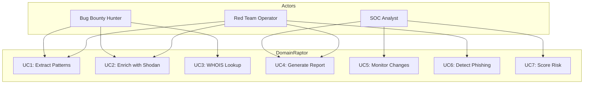
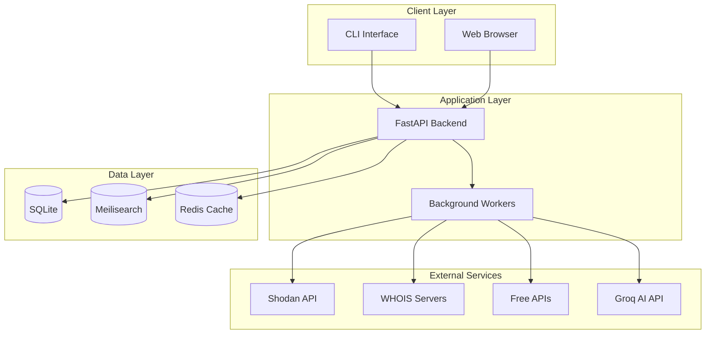
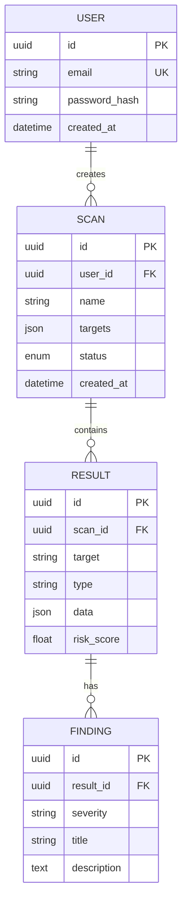
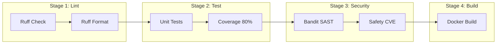

# DomainRaptor - Requirements & Specifications Document

> **Version**: 1.0.0-draft  
> **Last Updated**: March 2026  
> **Status**: Planning Phase  
> **License**: MIT (proposed)

---

## Table of Contents

1. [Vision & Goals](#1-vision--goals)
2. [Target Audience](#2-target-audience)
3. [Use Cases](#3-use-cases)
4. [Feature Catalog](#4-feature-catalog)
5. [Technical Architecture](#5-technical-architecture)
6. [API Integrations](#6-api-integrations)
7. [AI Strategy](#7-ai-strategy)
8. [Data & Storage](#8-data--storage)
9. [CI/CD Pipeline](#9-cicd-pipeline)
10. [Deployment](#10-deployment)
11. [Security Considerations](#11-security-considerations)
12. [Roadmap](#12-roadmap)
13. [Contributing Guidelines](#13-contributing-guidelines)
14. [License & Governance](#14-license--governance)
15. [Documentation & Wiki](#15-documentation--wiki)
16. [Usage Guide](#16-usage-guide)

---

## 1. Vision & Goals

### 1.1 Project Vision

**DomainRaptor** is an open-source cyber intelligence platform designed to help security professionals discover, enumerate, and assess the attack surface of organizations. It combines passive reconnaissance techniques with intelligent data enrichment to provide actionable security insights.

### 1.2 Problem Statement

Organizations struggle to maintain visibility over their external attack surface:

- **Shadow IT**: Unknown assets exposed to the internet
- **Configuration drift**: Misconfigured services and expired certificates
- **Vulnerability blind spots**: Outdated software versions with known CVEs
- **Lack of automation**: Manual reconnaissance is time-consuming and error-prone

### 1.3 Solution

DomainRaptor provides:

1. **Automated Discovery**: Extract IPs, domains, URLs from various sources
2. **Intelligent Enrichment**: Cross-reference with threat intelligence APIs
3. **Risk Scoring**: Prioritize findings based on exploitability
4. **Continuous Monitoring**: Track changes in attack surface over time
5. **Actionable Reports**: Generate executive and technical reports

### 1.4 Core Principles

| Principle | Description |
|-----------|-------------|
| **Open Source** | Community-driven development, transparent codebase |
| **Privacy First** | No data sent to third parties without explicit consent |
| **Lightweight** | Runs on minimal hardware (ARM64 compatible) |
| **Extensible** | Plugin architecture for custom integrations |
| **Ethical Use** | Designed for authorized security assessments only |
| **Free-First** | Prioritize free/open data sources over paid APIs |

### 1.5 Success Metrics

- **Adoption**: 1,000+ GitHub stars within first year
- **Performance**: Process 10,000 targets in under 5 minutes
- **Coverage**: Support 10+ threat intelligence sources
- **Reliability**: 99% uptime for web interface
- **Community**: 50+ contributors

### 1.6 Project Focus

```
┌─────────────────────────────────────────────────────────────────┐
│                    FOCUS FOR DOMAINRAPTOR                       │
├─────────────────────────────────────────────────────────────────┤
│                                                                 │
│  ✅ IMPLEMENTS:                    ❌ DOESN'T IMPLEMENTS:      │
│  ─────────────                  ────────────────                │
│  • Asset Discovery              • Active Scanning               │
│  • Passive Enumeration          • Exploitation                  │
│  • Vulnerability Mapping        • Generic Shodan Client         │
│  • Risk Scoring                 • Malware Detection             │
│  • Change Monitoring            • Intrusion Detection           │
│  • Executive Reporting                                          │
│                                                                 │
│  WHAT DOMAINRAPTOR IS: Attack Surface Management Tool           │
│  WHAT DOMAINRAPTOR ISN'T: Pentest Tool / Shodan Wrapper         │
│                                                                 │
└─────────────────────────────────────────────────────────────────┘
```

---

## 2. Target Audience

### 2.1 Primary Users

#### 2.1.1 Red Team Operators

**Profile**: Offensive security professionals conducting authorized penetration tests.

**Needs**:

- Fast reconnaissance of target organizations
- Comprehensive asset discovery
- Integration with existing toolchains (Burp, Nuclei, etc.)
- Export formats compatible with other tools

**Value Proposition**: Reduce reconnaissance time from hours to minutes.

#### 2.1.2 Security Operations Centers (SOC)

**Profile**: Teams monitoring organizational security posture.

**Needs**:

- Continuous attack surface monitoring
- Alerting on new exposures
- Dashboard for executive reporting
- Integration with SIEM systems

**Value Proposition**: Proactive identification of security gaps before attackers find them.

#### 2.1.3 Bug Bounty Hunters

**Profile**: Independent security researchers.

**Needs**:

- Subdomain enumeration
- Technology fingerprinting
- Low-cost or free tooling
- Efficient workflow automation

**Value Proposition**: Competitive edge in discovering vulnerabilities faster.

### 2.2 Secondary Users

- **DevSecOps Engineers**: Integrate security scanning into CI/CD pipelines
- **IT Asset Managers**: Inventory external-facing assets, compliance reporting
- **Security Researchers**: Academic research, threat landscape analysis

### 2.3 User Personas

```
┌─────────────────────────────────────────────────────────────────────────────┐
│                              USER PERSONAS                                  │
├─────────────────────────────────────────────────────────────────────────────┤
│  ┌─────────────────────────────────────────────────────────────────────┐    │
│  │  ALEX - Red Team Lead                                               │    │
│  │  Age: 32 | Experience: 8 years | Tools: Burp, Cobalt Strike, Nuclei │    │
│  │  Pain: Reconnaissance takes too long, manual processes              │    │
│  │  Goal: "I need to know everything about a target in 30 minutes"     │    │
│  └─────────────────────────────────────────────────────────────────────┘    │
│  ┌─────────────────────────────────────────────────────────────────────┐    │
│  │  MARIA - SOC Analyst                                                │    │
│  │  Age: 28 | Experience: 4 years | Tools: Splunk, TheHive, MISP       │    │
│  │  Pain: No visibility into external attack surface                   │    │
│  │  Goal: "I want to know when something new is exposed"               │    │
│  └─────────────────────────────────────────────────────────────────────┘    │
│  ┌─────────────────────────────────────────────────────────────────────┐    │
│  │  CARLOS - Bug Bounty Hunter                                         │    │
│  │  Age: 24 | Experience: 2 years | Tools: Amass, httpx, ffuf          │    │
│  │  Pain: Limited budget, needs free tools                             │    │
│  │  Goal: "Speed is money in bug bounties"                             │    │
│  └─────────────────────────────────────────────────────────────────────┘    │
└─────────────────────────────────────────────────────────────────────────────┘
```

---

## 3. Use Cases

### 3.1 Use Case Diagram



### 3.2 Detailed Use Cases

| ID | Name | Actor | Description |
|----|------|-------|-------------|
| UC1 | Extract Patterns | All | Extract IPs, domains, URLs from files using regex |
| UC2 | Enrich with Shodan | All | Query Shodan for port/service information |
| UC3 | WHOIS Lookup | All | Get domain registration information |
| UC4 | Generate Report | All | Export findings to JSON/CSV/PDF |
| UC5 | Monitor Changes | SOC | Track attack surface changes over time |
| UC6 | Detect Phishing | Red Team | Find typosquatting domains |
| UC7 | Score Risk | SOC | Calculate risk scores based on findings |

---

## 4. Feature Catalog

### 4.1 Feature Status Legend

| Status | Icon | Description |
|--------|------|-------------|
| Implemented | ✅ | Feature complete and tested |
| Partial | 🟡 | Partially implemented |
| Planned | 📋 | In roadmap, not started |
| Broken | 🔴 | Has bugs, needs fixing |

### 4.2 Core Features (CLI)

| ID | Feature | Status | Description | Priority |
|----|---------|--------|-------------|----------|
| F001 | IPv4 Extraction | 🟡 | Extract IPv4 addresses using regex | P0 |
| F002 | Domain Extraction | 🟡 | Extract domains and subdomains | P0 |
| F003 | URL Extraction | 🟡 | Extract URLs with various protocols | P0 |
| F004 | IPv6 Extraction | 🔴 | Extract IPv6 addresses (regex broken) | P0 |
| F005 | Multi-threading | ✅ | Parallel processing with threads | - |
| F006 | Shodan Enrichment | 🟡 | Query Shodan for domain/IP info | P1 |
| F007 | JSON Export | 📋 | Export results to JSON format | P2 |
| F008 | CSV Export | 📋 | Export results to CSV format | P2 |
| F009 | WHOIS Lookup | 📋 | Domain registration info (#7) | P3 |

### 4.3 Advanced Features (Planned)

| ID | Feature | Status | Description | Priority |
|----|---------|--------|-------------|----------|
| F010 | Passive Port Scan | 📋 | Ports from Shodan/LeakIX (#21) | P3 |
| F011 | Phishing Detection | 📋 | Typosquatting & homoglyph (#8) | P4 |
| F012 | HoneyPot Detection | 📋 | Identify honeypot services (#9) | P5 |
| F013 | Link Grabber | 📋 | Web crawler for links (#24) | P5 |
| F014 | SSL/TLS Audit | 📋 | Certificate and cipher analysis | P3 |
| F015 | CVE Correlation | 📋 | Match tech stack to CVEs | P4 |
| F016 | DNS Security Check | 📋 | SPF, DKIM, DMARC validation | P4 |
| F017 | Subdomain Discovery | 📋 | Via crt.sh, Shodan DNS | P2 |
| F018 | CVE Auto-Correlation | 📋 | From Shodan vulns field | P2 |
| F019 | Favicon Fingerprint | 📋 | Identify apps by favicon hash | P4 |
| F020 | SSL Analysis | 📋 | Certificate details from ssl field | P3 |
| F021 | Host History | 📋 | Timeline of changes (premium) | P4 |
| F022 | Organization Mapping | 📋 | Search by org name | P3 |
| F023 | ASN Enumeration | 📋 | Search by ASN | P3 |

### 4.4 CLI Structure v2 (Validated)

```
┌─────────────────────────────────────────────────────────────────────────────┐
│                      DOMAINRAPTOR CLI STRUCTURE v2                          │
├─────────────────────────────────────────────────────────────────────────────┤
│                                                                             │
│  WORKFLOWS (Core)                                                           │
│  ────────────────                                                           │
│  discover    Asset enumeration (subdomains, IPs, tech stack)                │
│  assess      Vulnerability & risk analysis                                  │
│    └─ vulns      CVE matching                                               │
│    └─ config     Misconfigurations                                          │
│    └─ outdated   EOL software                                               │
│  watch       Continuous monitoring with alerts                              │
│  compare     Point-in-time diff between scans                               │
│  report      Generate reports from stored data                              │
│                                                                             │
│  UTILITIES                                                                  │
│  ─────────                                                                  │
│  import      Import targets from other tools                                │
│  export      Export for other tools                                         │
│  config      Manage API keys, defaults                                      │
│  db          Database operations (list, prune, backup)                      │
│                                                                             │
│  MODES                                                                      │
│  ─────                                                                      │
│  --mode quick     Fast, essential only                                      │
│  --mode standard  Balanced (default)                                        │
│  --mode deep      Maximum detail                                            │
│  --mode stealth   Minimal footprint                                         │
│                                                                             │
└─────────────────────────────────────────────────────────────────────────────┘
```

---

## 5. Technical Architecture

### 5.1 System Overview



### 5.2 Technology Stack

| Layer | Technology | Justification |
|-------|------------|---------------|
| **Language** | Python 3.12+ | Match statements, performance |
| **CLI Framework** | argparse | Standard library, no deps |
| **Web Framework** | FastAPI | Async, auto-docs, modern |
| **Frontend** | React + Vite | Fast builds, ecosystem |
| **Database** | SQLite → PostgreSQL | Light start, scalable |
| **Search** | Meilisearch | Lightweight, ARM64 |
| **Cache** | Redis | Fast, pub/sub |
| **Proxy** | Caddy | Auto HTTPS |
| **Container** | Docker | Consistent deployment |

### 5.3 Design Decisions

| Decision | Choice | Rationale |
|----------|--------|-----------|
| CLI vs Web dependency | Separate | CLI users don't need web overhead |
| Initial database | SQLite | No additional process, easy backup |
| Search engine | Meilisearch | 10x lighter than Elasticsearch |
| AI model | Groq (free) → Claude | Start free, scale with budget |

---

## 6. API Integrations

### 6.1 Data Sources Strategy: Free-First Approach

```
┌─────────────────────────────────────────────────────────────────────────────────────────┐
│                         DATA SOURCES PRIORITY MATRIX                                    │
├─────────────────────────────────────────────────────────────────────────────────────────┤
│                                                                                         │
│  Funcionalidad          Fuente Gratuita (P1)      Fuente Pagada (P2)    Fallback        │
│  ─────────────────────────────────────────────────────────────────────────────────────  │
│                                                                                         │
│  Subdomain Discovery    crt.sh ✅                 Shodan DNS            DNS brute       |
│                         HackerTarget ✅                                                 │
│                                                                                         │
│  DNS Resolution         dnspython ✅              -                     socket          |
│                                                                                         │
│  Port/Services          Shodan (user API) ✅      -                     Censys         │
│                                                                                         │
│  WHOIS                  python-whois ✅           -                     whois CLI      │
│                                                                                         │
│  CVE Data               NVD/NIST API ✅           -                     CVE.org        │
│                         OSV (Google) ✅                                                 │
│                                                                                         │
│  Technology Detection   Wappalyzer rules ✅       -                     Manual sigs    │
│                                                                                         │
│  SSL/TLS Analysis       sslyze ✅                 -                     openssl        │
│                                                                                         │
│  IP Geolocation         ip-api.com ✅             -                     MaxMind        │
│                                                                                         │
│  ASN/Org Lookup         ipwhois ✅                Shodan                BGPView        │
│                                                                                         │
│  AI Analysis            Groq ✅ (free tier)       Claude API            Ollama local   │
│                                                                                         │
└─────────────────────────────────────────────────────────────────────────────────────────┘
```

### 6.2 Free Data Sources

| Source | Data Type | Registration | Limits | Quality |
|--------|-----------|--------------|--------|---------|
| [crt.sh](https://crt.sh) | Certificate Transparency | No | Unlimited | HIGH |
| [HackerTarget](https://hackertarget.com) | DNS/Reverse IP | No | 100/day | MEDIUM |
| [AlienVault OTX](https://otx.alienvault.com) | Threat Intel | Free account | 1000/hour | HIGH |
| [NVD/NIST](https://nvd.nist.gov) | CVE Database | Optional key | 5-50 req/30s | AUTHORITATIVE |
| [URLScan.io](https://urlscan.io) | Web Analysis | Free account | Limited | MEDIUM |
| [ip-api.com](https://ip-api.com) | Geolocation | No | 45/minute | HIGH |
| [SSL Labs](https://ssllabs.com) | SSL Analysis | No | 25/hour | EXCELLENT |
| [OSV (Google)](https://osv.dev) | Open Source Vulns | No | Generous | HIGH |

### 6.3 Optional Paid APIs (User-Provided)

| Source | Benefit | Free Tier |
|--------|---------|-----------|
| [Shodan](https://shodan.io) | Port scanning, banners, vulns | 100 queries/month |
| [VirusTotal](https://virustotal.com) | Malware reputation | 4 req/minute |
| [SecurityTrails](https://securitytrails.com) | Historical DNS | 50 queries/month |

### 6.4 Shodan Integration (Expanded)

#### Available Endpoints

| Endpoint | Free | Paid | Use Case |
|----------|------|------|----------|
| `/shodan/host/{ip}` | ✅ 100/mo | ✅ | Host info, ports |
| `/shodan/host/{ip}?history=true` | ❌ | ✅ | Historical changes |
| `/dns/domain/{domain}` | ✅ | ✅ | Subdomain enum |
| `/dns/resolve` | ✅ | ✅ | Bulk DNS resolution |
| `/dns/reverse` | ✅ | ✅ | Reverse DNS |
| `/shodan/search` | ✅ Limited | ✅ | Search by filters |

#### Query Templates

```python
SHODAN_QUERY_TEMPLATES = {
    "by_domain": "hostname:{domain}",
    "by_org": 'org:"{organization}"',
    "by_asn": "asn:AS{number}",
    "by_ssl_cn": 'ssl.cert.subject.cn:"{domain}"',
    "by_cidr": "net:{cidr}",
    "by_cve": "vuln:{cve_id}",
    "by_favicon": "http.favicon.hash:{hash}",
}
```

### 6.5 Source Configuration

```yaml
sources:
  tier1_free:  # Always use
    - crt.sh
    - dnspython
    - python-whois
    - sslyze
    - nvd_nist
    
  tier2_freemium:  # Optional, free registration
    - alienvault_otx
    - urlscan_io
    - censys
    
  tier3_paid:  # User provides API key
    - shodan
    - virustotal

fallback:
  enabled: true
  order: [tier1_free, tier2_freemium, tier3_paid]
```

---

## 7. AI Strategy

### 7.1 AI Integration Goals

| Goal | Description | Benefit |
|------|-------------|---------|
| Natural Language Search | Query results in plain English | Lower barrier |
| Intelligent Prioritization | Rank findings by risk | Focus on what matters |
| Automated Reporting | Generate executive summaries | Save time |

### 7.2 Model Selection (Cost-Optimized)

| Model | Provider | Cost | Use Case |
|-------|----------|------|----------|
| Mixtral 8x7B | Groq | **FREE** | NL queries, summaries |
| Llama 2 7B | Ollama | **FREE** | Simple classification |
| Claude Haiku | Anthropic | $0.25/1M | Complex analysis |

### 7.3 Implementation Strategy

**Phase 1**: Groq free tier for all AI features
**Phase 2**: Local Ollama when self-hosting
**Phase 3**: Claude for premium features (optional)

---

## 8. Data & Storage

### 8.1 Database Schema



### 8.2 Data Retention

| Data Type | Retention | Reason |
|-----------|-----------|--------|
| Scan results | 30 days | Storage optimization |
| User accounts | Indefinite | Login required |
| API cache | 1-24 hours | API rate limits |
| Audit logs | 90 days | Compliance |

---

## 9. CI/CD Pipeline

### 9.1 Pipeline Overview



### 9.2 GitHub Actions Triggers

- **Push to develop**: Full pipeline
- **PR to main/release**: Full pipeline
- **Release tag**: Build + Deploy

---

## 10. Deployment

### 10.1 Target Environment

| Environment | Hardware | RAM Budget |
|-------------|----------|------------|
| Staging | Pine64 A64 (2GB) | ~880MB used |
| Production | VPS 4GB+ | ~2GB used |

### 10.2 Resource Allocation (Pine64)

```
Backend (FastAPI)    256 MB
Meilisearch          128 MB
Redis                 64 MB
Caddy                 32 MB
─────────────────────────
Total               ~480 MB + OS
```

---

## 11. Security Considerations

### 11.1 OWASP Top 10 Mitigations

| Risk | Mitigation |
|------|------------|
| A01: Broken Access Control | JWT validation, RBAC |
| A02: Cryptographic Failures | HTTPS only, secrets in env |
| A03: Injection | Parameterized queries |
| A07: Auth Failures | OAuth, rate limiting |

### 11.2 Rate Limiting

| Endpoint | Limit | Window |
|----------|-------|--------|
| `/auth/login` | 5 | 15 min |
| `/scans` (POST) | 10 | 1 hour |
| `/search` | 60 | 1 min |

---

## 12. Roadmap

### 12.1 Development Phases

```
┌─────────────────────────────────────────────────────────────────────────────┐
│                      DEVELOPMENT PHASES - MARCH 2026                        │
├─────────────────────────────────────────────────────────────────────────────┤
│                                                                             │
│  Phase   Description                              Status                    │
│  ─────   ───────────────────────────────────────  ───────                   │
│  0-2     Bug fixes, Dev tools, CLI structure      ✅ COMPLETE               │
│  3       Discovery (crt.sh, DNS, WHOIS, etc.)     ✅ COMPLETE               │
│  4       Assessment (SSL, Headers, DNS security)  ✅ COMPLETE               │
│  5       Storage (SQLite persistence)             📋 NEXT                   │
│  6       Watch/Monitoring (continuous scan)       📋 PLANNED                │
│  7       Compare (historical diff)                📋 PLANNED                │
│  8       Reporting (JSON, HTML, Markdown, PDF)    📋 PLANNED                │
│  9       Web UI (FastAPI + React)                 📋 FUTURE                 │
│                                                                             │
└─────────────────────────────────────────────────────────────────────────────┘
```

### 12.2 Version Milestones

#### v0.2.0 - Foundation (Q1 2026) ✅ COMPLETE

- [x] Project structure reorganization
- [x] Fix critical bugs (Phase 0)
- [x] Development environment setup (Ruff, pyproject.toml)
- [x] CLI framework with Typer + Rich
- [x] Core types and configuration

#### v0.3.0 - Discovery & Assessment (Q1 2026) ✅ COMPLETE

- [x] Discovery module with free data sources:
  - [x] crt.sh (Certificate Transparency)
  - [x] HackerTarget (DNS/subdomains)
  - [x] dnspython (DNS resolution)
  - [x] python-whois (WHOIS lookup)
- [x] Discovery orchestrator (parallel execution)
- [x] Assessment module:
  - [x] SSL/TLS analyzer (protocols, ciphers, certs)
  - [x] HTTP security headers checker (HSTS, CSP, etc.)
  - [x] DNS security checker (DNSSEC, SPF, DMARC, DKIM, CAA)
- [x] Assessment orchestrator

#### v0.4.0 - Persistence & Monitoring (Q2 2026) 🔄 IN PROGRESS

- [ ] SQLite storage backend
- [ ] Scan history persistence
- [ ] Watch mode (continuous monitoring)
- [ ] Change detection and alerts
- [ ] Compare scans over time

#### v0.5.0 - Reporting (Q2 2026)

- [ ] JSON export
- [ ] HTML reports with templates
- [ ] Markdown reports
- [ ] PDF generation
- [ ] Executive summary templates

#### v1.0.0 - Production Ready (Q3-Q4 2026)

- [ ] Web UI (FastAPI backend + React frontend)
- [ ] User authentication
- [ ] Full documentation
- [ ] Security audit completed
- [ ] 80% test coverage

### 12.3 Feature Status

| Feature | Status | Phase |
|---------|--------|-------|
| Subdomain Discovery (crt.sh) | ✅ Complete | 3 |
| Subdomain Discovery (HackerTarget) | ✅ Complete | 3 |
| DNS Resolution | ✅ Complete | 3 |
| WHOIS Lookup | ✅ Complete | 3 |
| SSL/TLS Analysis | ✅ Complete | 4 |
| HTTP Headers Audit | ✅ Complete | 4 |
| DNS Security (SPF/DMARC/DKIM) | ✅ Complete | 4 |
| DNSSEC Validation | ✅ Complete | 4 |
| CAA Record Check | ✅ Complete | 4 |
| SQLite Storage | 📋 Planned | 5 |
| Watch Mode | 📋 Planned | 6 |
| Scan Comparison | 📋 Planned | 7 |
| Report Generation | 📋 Planned | 8 |
| CVE Correlation | 📋 Planned | Future |
| Web UI | 📋 Planned | Future |

### 12.4 Priority Matrix

| Task | Impact | Effort | Priority |
|------|--------|--------|----------|
| Storage module | High | Medium | P0 - NEXT |
| Watch/Monitor | High | Medium | P1 |
| Report export | High | Low | P2 |
| Scan comparison | Medium | Low | P3 |
| Web UI | High | High | P4 |
| CVE correlation | Medium | Medium | P5 |

---

## 13. Contributing Guidelines

### 13.1 Development Workflow

```bash
git clone https://github.com/YOUR_USERNAME/DomainRaptor.git
cd DomainRaptor
pip install -e ".[dev]"
pre-commit install
git checkout -b feature/your-feature
```

### 13.2 Commit Messages

Follow [Conventional Commits](https://www.conventionalcommits.org/):

```
feat(shodan): add port scanning integration
fix(regex): correct IPv6 pattern matching
docs(readme): update installation instructions
```

### 13.3 Code Standards

- Follow PEP 8 (enforced by Ruff)
- Maximum line length: 100 characters
- Use type hints for all functions
- Write docstrings for public APIs

---

## 14. License & Governance

### 14.1 License

MIT License - Maximum compatibility and adoption.

### 14.2 Ethical Use Policy

DomainRaptor is designed for **legitimate security purposes only**:

✅ **Permitted**: Authorized pentesting, bug bounties (with permission), security research

❌ **Prohibited**: Unauthorized scanning, malicious reconnaissance, privacy violations

---

## 15. Documentation & Wiki

### 15.1 Documentation Structure

```
wiki/
├── Home.md
├── Getting-Started/
│   ├── Installation.md
│   ├── Quick-Start.md
│   └── Configuration.md
├── User-Guide/
│   ├── CLI-Reference.md
│   └── Workflows/
│       ├── Discovery.md
│       ├── Assessment.md
│       └── Monitoring.md
├── Integrations/
│   ├── Shodan.md
│   ├── WHOIS.md
│   └── Import-Export/
├── Deployment/
│   ├── Docker-Compose.md
│   └── Pine64-Setup.md
└── Development/
    ├── Contributing.md
    └── Architecture.md
```

---

## 16. Usage Guide

### 16.1 Installation

```bash
# pip
pip install domainraptor

# Docker
docker pull ghcr.io/ernestocubo/domainraptor:latest

# From source
git clone https://github.com/ErnestoCubo/DomainRaptor.git
cd DomainRaptor && uv sync
```

### 16.2 Configuration

```bash
domainraptor config set shodan.api_key "YOUR_KEY"
domainraptor config set output.default_format "json"
```

### 16.3 Workflow Examples

```bash
# Discovery
domainraptor discover example.com
domainraptor discover --org "Acme Corp" --mode deep

# Assessment
domainraptor assess example.com
domainraptor assess vulns example.com --severity critical

# Monitoring
domainraptor watch example.com  # Add to cron

# Compare
domainraptor compare --baseline scan_001 --current scan_002

# Report
domainraptor report --last --format pdf --template executive

# Source control
domainraptor discover example.com --free-only
domainraptor discover example.com --sources crt.sh,hackertarget
```

### 16.4 Pipeline Example

```yaml
# pipeline.yaml
name: "Weekly Assessment"
targets: [example.com]
steps:
  - workflow: discover
    options: {mode: deep}
  - workflow: assess
    filter: severity >= high
  - workflow: report
    format: [pdf, json]
```

```bash
domainraptor run pipeline.yaml
```

---

## Appendix A: Glossary

| Term | Definition |
|------|------------|
| ASM | Attack Surface Management |
| CVE | Common Vulnerabilities and Exposures |
| OSINT | Open Source Intelligence |

---

*Document maintained by @ErnestoCubo*  
*Last reviewed: March 2026*
