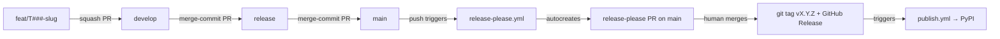

# Release Process

DomainRaptor uses a three-branch release train driven by
[release-please](https://github.com/googleapis/release-please) and a
trio of agents (`@pr-opener`, `@pr-merger`, `@release-manager`).

## Branches

| Branch | Purpose | Who pushes |
|---|---|---|
| `feat/<topic>` or `feat/T###-<slug>` | Single task or feature | `@task-implementer` (or you) |
| `develop` | Integration trunk | Nobody directly. Only via merged PR from `feat/*` |
| `release` | Release candidate / staging | Nobody directly. Only via merged PR from `develop` |
| `main` | Production | Nobody directly. Only via merged PR from `release`, plus release-please's own versioning PR |

Direct push to `develop`, `release` or `main` is forbidden (rule #5 in
[wiki/Installation.md](Installation.md) tooling section + branch protection).

## Flow



## Who drives each arrow

| Arrow | Agent | Auto-merge? |
|---|---|---|
| `feat/* → develop` | `@pr-opener` opens, `@pr-merger` merges | ✅ if all gates green |
| `develop → release` | `@release-manager` decides, `@pr-opener` opens, `@pr-merger` merges | ❌ human confirms |
| `release → main` | `@release-manager` decides, `@pr-opener` opens, `@pr-merger` merges | ❌ human confirms |
| versioning PR on `main` | release-please | ❌ human merges |
| publish to PyPI | `publish.yml` | ✅ on tag push |

## Conventional Commits → version bump

See the table in
[copilot-instructions.md](../.github/copilot-instructions.md#version-bump-table)
(single source of truth). Mirror in `/memories/repo/commits.md`.

Promotion PRs use `chore(release):` — release-please ignores them.

## Required GitHub branch protection rules

Apply these manually in GitHub → Settings → Branches.

### `main`

- Require a pull request before merging.
- Require review from `ErnestoCubo` (CODEOWNERS).
- Required status checks (strict, must pass before merge):
  - `lint`, `test`, `security`, `build` (from `ci.yml`).
  - `validate-frontmatter` (from `ai-audit.yml`) if PR touches
    `.github/{agents,prompts,instructions}/**`.
- Dismiss stale reviews on push.
- Restrict who can push: nobody (PR-only).
- Disallow force pushes.
- Disallow deletions.
- Require linear history: **off** (we use merge commits for promotions
  so release-please sees the full history).
- Require signed commits: optional, recommended.

### `release`

- Same as `main`, minus the "require linear history" note (same value: off).
- Required reviewer: `ErnestoCubo` + `@qa-reviewer` posted PASS.

### `develop`

- Require a pull request before merging.
- Required status checks: `lint`, `test`.
- Dismiss stale reviews on push.
- Restrict who can push: nobody.
- Disallow force pushes.
- Disallow deletions.
- Reviewer requirement: at least one agentic review (`@qa-reviewer`).

## Step-by-step: cutting a release

1. **Verify train state**

   ```
   @release-manager status
   ```

   Shows pending commits per leg and the expected version bump.

2. **Promote `develop → release`**

   ```
   @release-manager promote develop
   ```

   `@pr-opener` opens a PR titled
   `chore(release): promote develop → release (YYYY-MM-DD)`.
   `@pr-merger` posts "Ready to merge, awaiting human confirmation".
   You merge.

3. **CI on `release`**
   Wait for `ci.yml` to go green on the new `release` head.

4. **Promote `release → main`**

   ```
   @release-manager promote release
   ```

   Same dance. Merging this triggers `release-please.yml`.

5. **Validate release-please PR**

   ```
   @release-manager finalize
   ```

   Verifies the CHANGELOG and `pyproject.toml` bump matches the
   expected version. If OK, posts "validated", you merge.

6. **Tag + Release + PyPI**
   Merging the release-please PR creates the git tag, the GitHub
   Release, and triggers `publish.yml` for PyPI.

## Forcing a specific version

Before step 2, ask `@task-implementer` to add a single commit on
`develop` with footer:

```
Release-As: 0.7.0
```

Document the override in
`.github/sprints/sprint-NNN-<slug>/release/train-log.md`.

## Hotfix flow

For a critical fix that bypasses `develop`:

1. Branch from `main`: `git checkout -b fix/<slug> main`.
2. Open PR `fix/<slug> → main` directly. CODEOWNER review required.
3. After merge, cherry-pick to `release` and `develop`.
4. release-please will cut a patch on the next push to `main`.

## What NOT to do

- Don't push to `develop`, `release`, or `main` directly.
- Don't edit `CHANGELOG.md` manually.
- Don't delete the `release` branch.
- Don't use `--admin` to bypass branch protection.
- Don't use `--no-verify` to skip pre-commit.
- Don't squash-merge `develop → release` or `release → main` —
  release-please needs the per-feat history.
